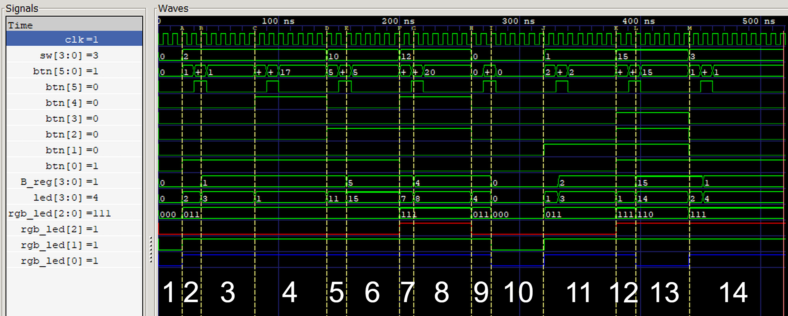
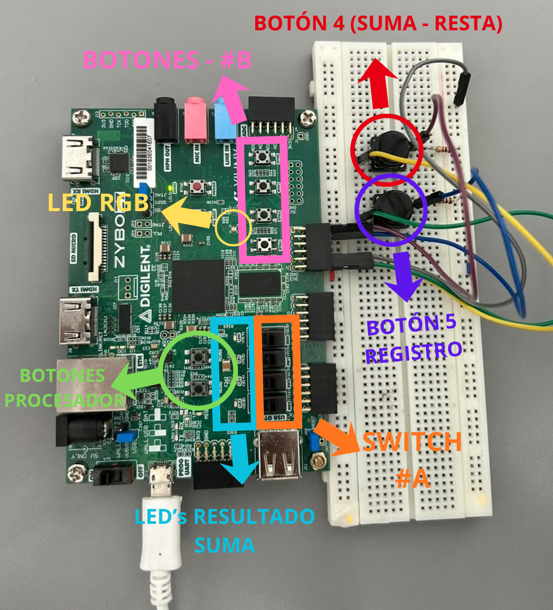
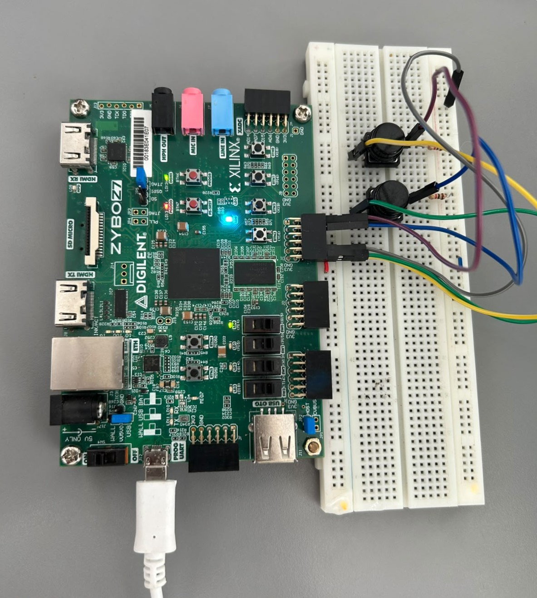
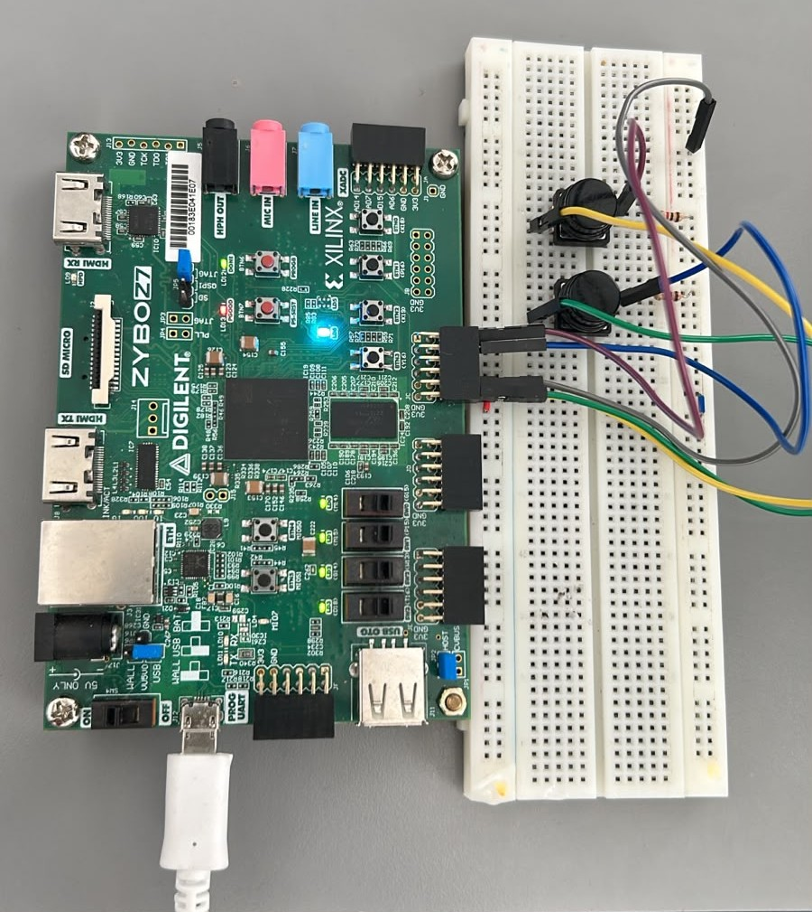
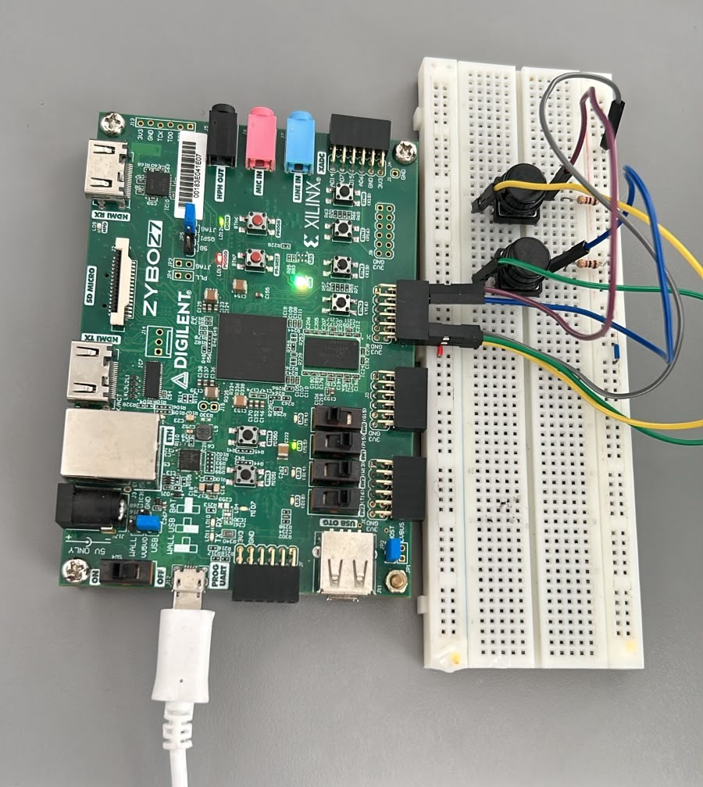
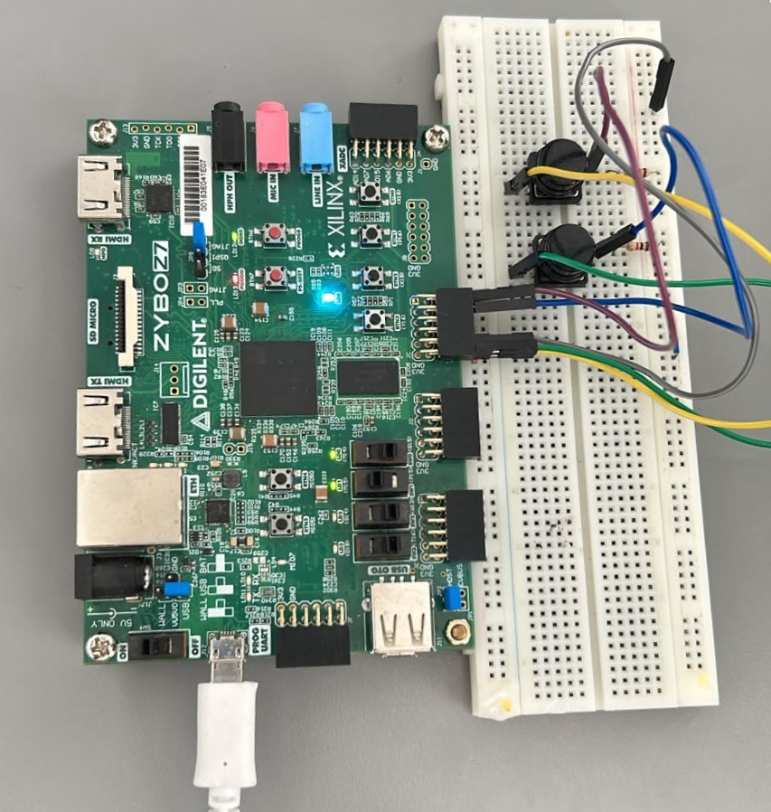
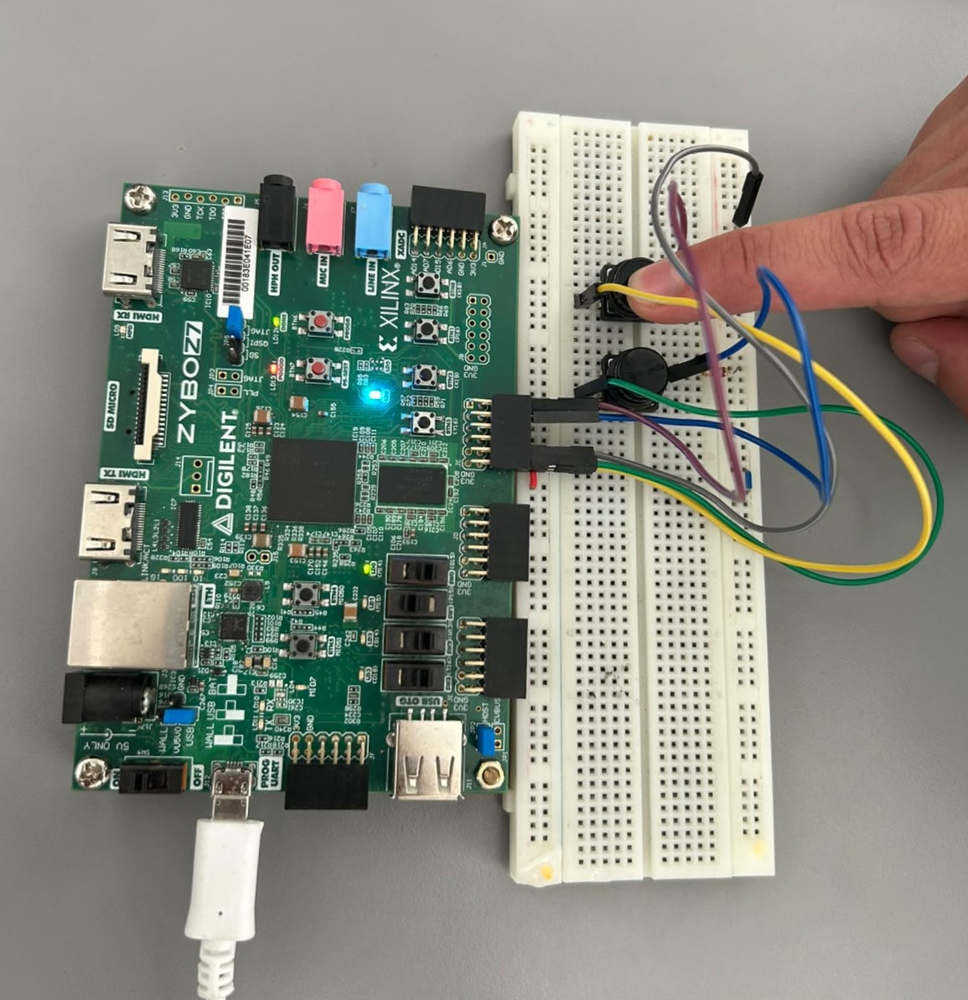

# Laboratorio 01
## FPGA (Zybo Z7), Vivado/Vitis y Validación de Hardware

---

## Integrantes  
- Julian David Gomez Gonzalez
- Cristian Norbey Hernández Gualteros - 1001091723
- Milton Nicolas Rincón Caicedo

**Grupo de trabajo:**  
**Semestre:** 2026-1

---

## Índice
- [Diseño implementado](#diseño-implementado)
- [Simulaciones](#simulaciones)
- [Implementación](#implementación)
- [Conclusiones](#conclusiones)
- [Referencias](#referencias)

---

## Diseño implementado

Describa brevemente los diseños realizados en el laboratorio.

Incluya:
- Tipo de sistema (FSM, FSM + datapath).
- Estados definidos.
- Funcionamiento general del sistema.

Cuando aplique, incluya el diagrama de la máquina de estados.

---

## Simulaciones

### Verificación y Simulación del Diseño

#### Descripción del testbench

El testbench fue diseñado para verificar el correcto funcionamiento del módulo principal (`top_alu.v`) insertando señales controladas que emulan la interacción del usuario con el hardware. Se configuró un reloj de 125 MHz y se programó una tarea repetitiva (`guardar_b`) que simula la pulsación del botón `btn[5]` para almacenar el operando $B$ en el registro. El código evalúa secuencialmente operaciones aritméticas (sumas y restas con operandos pequeños y grandes) y, posteriormente, inyecta casos específicos para validar la lógica del indicador de estado RGB. 

A continuación, se detallan las evidencias de la simulación extraídas de GTKWave junto con su respectivo análisis.

#### Señales observadas

Durante la simulación en GTKWave se monitorearon las siguientes señales:

*   **Entradas:** `clk` (señal de reloj), `sw[3:0]` (operando $A$ de entrada directa) y `btn[5:0]` (incluye el operando $B$ a registrar, el selector de suma/resta y el botón de guardado).
*   **Salidas:** `led[3:0]` (resultado binario de la operación aritmética) y `rgb_led[2:0]` (indicador de estado lógico de las compuertas AND, OR y XOR).

Tal y como se visualiza en la siguiente imagen:

#### Resultados obtenidos

Para la explicación de los resultados obtenidos del `tb_simulacion.v`, en la siguiente imagen se visualiza la simulación en GTKWave dividida en 14 zonas diferentes. Esto facilita la explicación y hace evidente cómo cambian las señales con cada una de las pruebas realizadas, todo ello con la finalidad de probar el correcto funcionamiento de la FPGA Zybo-Z7-10.

A continuación, se detalla el comportamiento del circuito en cada zona temporal de la simulación:

*   **Zona 1:** Estado inicial de reposo. No se ha modificado ninguna señal.
*   **Zona 2:** El operando $A$ toma el valor de 2 y $B$ toma el valor de 1 en los interruptores. Sin embargo, como no se ha presionado el botón de guardado (`btn[5]`), el registro interno de $B$ sigue siendo 0. Por lo tanto, la suma (`led[3:0]`) es igual a 2 ($2 + 0$).
*   **Zona 3:** Se presiona el `btn[5]`, actualizando el registro de $B$ con el valor 1. Se efectúa la suma, dando como resultado 3 en `led[3:0]` ($2 + 1 = 3$).
*   **Zona 4:** Se activa el `btn[4]` (modo resta). El resultado en `led[3:0]` cambia a 1 ($2 - 1 = 1$).
*   **Zona 5:** El operando $A$ toma el valor de 10 y $B$ el valor de 5 en los interruptores. Al no haberse presionado `btn[5]`, el registro conserva el 1 anterior y el modo de operación vuelve a suma. El resultado en `led[3:0]` toma el valor de 11 ($10 + 1 = 11$).
*   **Zona 6:** Se presiona el `btn[5]` y se guarda el 5 en el registro de $B$. Se efectúa la suma dando como resultado 15 en `led[3:0]` ($10 + 5 = 15$). Esta operación verifica que los 4 LEDs verdes de la suma funcionan correctamente al encenderse todos a la vez.
*   **Zona 7:** El operando $A$ toma el valor de 12 y $B$ permanece con el valor de 5. Se activa el `btn[4]` (resta), por lo que la salida `led[3:0]` toma el valor de 7 ($12 - 5 = 7$).
*   **Zona 8:** El operando $B$ cambia de valor a 4 en los interruptores y se guarda en el registro. Como permanece activo el `btn[4]` (resta), el resultado en `led[3:0]` toma el valor de 8 ($12 - 4 = 8$).
*   **Zona 9:** El operando $A$ cambia de valor a 0 preparándose para la validación de la lógica RGB.
*   **Zona 10:** Los operandos $A$ y $B$ son cero. Al no haber bits activos, las compuertas lógicas arrojan cero y el LED RGB está totalmente apagado (Estado 000).
*   **Zona 11:** El operando $A$ cambia a 1 y $B$ se actualiza a 2. Al tener bits activos en posiciones distintas (0001 y 0010), se detecta presencia (OR) y diferencia (XOR), pero no coincidencia (AND). Esto enciende el LED Verde y el Azul (Cyan: 011).
*   **Zona 12:** El operando $A$ cambia a 15 (1111) en los interruptores. Se observa una transición en la lógica antes de guardar el nuevo operando $B$.
*   **Zona 13:** El operando $B$ se actualiza a 15 (1111). Al ser idénticos ambos operandos ($A=15$, $B=15$), hay coincidencia y presencia en los bits, pero la diferencia es nula (XOR = 0). Como resultado, se encienden los LEDs Rojo y Verde (Amarillo: 110).
*   **Zona 14:** El operando $A$ cambia a 3 (0011) y $B$ se actualiza a 1 (0001). Ambos números comparten el primer bit, pero difieren en el segundo. Se cumplen simultáneamente todas las condiciones lógicas, activando los tres canales para formar el color Blanco (RGB Completo: 111).

---

En resumen, las formas de onda resultantes confirmaron el funcionamiento esperado del circuito, dividiéndose en dos etapas de validación clave:

#### A. Validación Aritmética (Señal `led`):
Se verificaron cuatro casos de prueba controlados:
*   **Suma (2 + 1):** Al ingresar $A=2$ y $B=1$ con `btn[4]=0`, la salida mostró 0011 (3 en decimal).
*   **Resta (2 - 1):** Con los mismos operandos y activando `btn[4]=1`, la salida cambió correctamente a 0001 (1).
*   **Suma mayor (10 + 5):** Se probó la capacidad de los 4 bits; la salida mostró 1111 (15).
*   **Resta mayor (12 - 4):** El sistema calculó la diferencia arrojando 1000 (8).

#### B. Validación del Indicador Lógico (Señal `rgb_led`):
Se buscó representar el encendido de los colores considerando la restricción matemática del diseño: no es posible encender los canales Rojo o Azul de forma aislada, ya que la existencia de bits compartidos (AND) o diferentes (XOR) fuerza siempre la activación de la compuerta OR (Verde). Por ello, se verificaron los 4 únicos estados posibles:
*   **Apagado (000):** Operandos en cero ($A=0$, $B=0$).
*   **Cyan / Verde+Azul (011):** Bits activos en posiciones distintas ($A=1$, $B=2$). Se detecta presencia y diferencia, pero no coincidencia.
*   **Amarillo / Rojo+Verde (110):** Operandos idénticos ($A=15$, $B=15$). Hay coincidencia y presencia, pero la diferencia es nula (XOR = 0).
*   **Blanco / RGB Completo (111):** Comparten un bit, pero difieren en otro ($A=3$, $B=1$). Todas las condiciones lógicas se cumplen simultáneamente.
---

## Implementación del Diseño en Verilog

### Organización del Código
El diseño de la ALU se estructuró en un único módulo (`top_alu.v`) siguiendo una arquitectura de flujo de datos híbrida (combinacional y secuencial). El código se divide en las siguientes etapas lógicas:
1.  **Enrutamiento de Entradas:** Asignación directa de los interruptores físicos (`sw[3:0]`) al operando $A$.
2.  **Lógica Secuencial (Memoria):** Implementación de un registro de 4 bits (`B_reg`) para almacenar el operando $B$ proveniente de la botonera.
3.  **Lógica Combinacional Paralela:** Ejecución simultánea e ininterrumpida de las operaciones aritméticas (sumador/restador controlado por multiplexor) y compuertas lógicas bit a bit (AND, OR, XOR).
4.  **Asignación de Salidas:** Enrutamiento de los resultados a los periféricos físicos de la placa (LEDs verdes para aritmética y LED RGB mediante operadores de reducción para el estado lógico).

### Manejo de Reloj y Reset

*   **Señal de Reloj (Clock):** El sistema utiliza el oscilador interno de la tarjeta Zybo Z7, el cual ingresa por el pin K17 a una frecuencia de 125 MHz. Esta señal de reloj (`clk`) se utiliza exclusivamente para sincronizar el bloque secuencial del registro $B$. La captura de datos se realiza por flanco de subida (`posedge clk`) condicionado a la habilitación (enable) del botón `btn[5]`.
*   **Manejo de Reset:** El diseño optó por prescindir de un reset asíncrono o síncrono mapeado a un botón físico. En su lugar, se implementó un **Power-on Reset (POR)** mediante la inicialización directa en la declaración del registro (`reg [3:0] B_reg = 4'b0000;`). Esto garantiza que, al cargar el *bitstream* en la FPGA, la memoria arranque en un estado seguro y conocido (cero).

### Comportamiento Esperado del Sistema

Al operar físicamente la FPGA, el sistema responde de la siguiente manera:
1.  **Ingreso en Tiempo Real:** Cualquier cambio en los interruptores (`sw[3:0]`) modifica instantáneamente el operando $A$, actualizando en tiempo real tanto la suma/resta en los LEDs verdes como el estado lógico en el LED RGB.
2.  **Almacenamiento en Demanda:** El usuario ingresa un valor en `btn[3:0]`. Este valor no afecta al sistema hasta que se presiona `btn[5]`. Al presionarlo, en el siguiente flanco del reloj (cuestión de nanosegundos), el valor queda guardado en la memoria interna de la ALU y pasa a ser el operando $B$ oficial.
3.  **Selector de Operación:** El interruptor o botón asignado a `btn[4]` actúa como un selector de modo en tiempo real; en estado bajo (`0`) el sistema suma $A + B$, y en estado alto (`1`) el sistema resta $A - B$. Las operaciones lógicas en el LED RGB no se ven interrumpidas por este cambio, ya que se procesan en rutas de datos paralelas.
---

## Resultados

**Visualización botones, switches y leds en la FPGA:**

**Registro:**

**Registro Grande:**

**Suma:**

**Resta:**

## Conclusiones

- Principales aprendizajes del laboratorio.
- Dificultades encontradas.
- Importancia de la simulación en el diseño digital.

---

## Referencias

1. [**Zybo Z7 Board Reference Manual** - Digilent](https://digilent.com/reference/programmable-logic/zybo-z7/reference-manual)  
   *Manual técnico oficial de la placa Zybo Z7, especificaciones de hardware y periféricos.*

2. [**Zynq-7000 SoC Technical Reference Manual (TRM)** - AMD / Xilinx](https://docs.amd.com/r/en-US/ug585-zynq-7000-SoC-TRM/Introduction?tocId=oRoKUQufl_PGU6ByBXr1ag)  
   *Documentación técnica del chip Zynq-7000, arquitectura y detalles internos.*

3. [**Archivo de Restricciones Maestro (Master XDC) para Zybo-Z7-10** - Repositorio Oficial de Digilent en GitHub](https://github.com/Digilent/Zybo-Z7-10-XADC/blob/master/src/constraints/Zybo-Z7.xdc)  
   *Archivo de configuración (XDC) que mapea las variables físicas a los puertos lógicos de la FPGA.*

