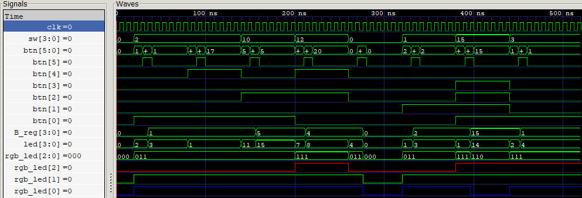

# Laboratorio 01
## FPGA (Zybo Z7), Vivado/Vitis y Validación de Hardware

---

## Integrantes  
- Julian David Gomez Gonzalez
- Cristian Norbey Hernández Gualteros - 1001091723
- Milton Nicolas Rincón Caicedo

**Grupo de trabajo:**  
**Semestre:** 2026-1

---

## Índice
- [Diseño implementado](#diseño-implementado)
- [Simulaciones](#simulaciones)
- [Implementación](#implementación)
- [Conclusiones](#conclusiones)
- [Referencias](#referencias)

---

## Diseño implementado

Describa brevemente los diseños realizados en el laboratorio.

Incluya:
- Tipo de sistema (FSM, FSM + datapath).
- Estados definidos.
- Funcionamiento general del sistema.

Cuando aplique, incluya el diagrama de la máquina de estados.

---

## Simulaciones

### Verificación y Simulación del Diseño

#### Descripción del testbench

El testbench fue diseñado para verificar el correcto funcionamiento del módulo principal `(top_alu.v)` insertando señales controladas que emulan la interacción del usuario con el hardware. Se configuró un reloj de 125 MHz y se programó una tarea repetitiva `(guardar_b)` que simula la pulsación del botón `btn[5]` para almacenar el operando B en el registro. El código evalúa secuencialmente operaciones aritméticas (sumas y restas con operandos pequeños y grandes) y, posteriormente, inyecta casos específicos para validar la lógica del indicador de estado RGB. 

#### Señales observadas

Durante la simulación en GTKWave se monitorearon las siguientes señales:

***Entradas:*** `clk` (señal de reloj), `sw[3:0]` (operando A de entrada directa) y `btn[5:0]` (incluye el operando B a registrar, el selector de suma/resta y el botón de guardado).
***Salidas:*** `led[3:0]` (resultado binario de la operación aritmética) y `rgb_led[2:0]` (indicador de estado lógico de las compuertas AND, OR y XOR).

Tal y como se visualiza en la siguiente imagen:

#### Resultados obtenidos

Para la explicación de la 
Las formas de onda resultantes confirmaron el funcionamiento esperado del circuito, dividiéndose en dos etapas de validación:

#### A. Validación Aritmética (Señal `led`):
Se verificaron cuatro casos de prueba controlados

- **Suma (2 + 1):** Al ingresar A=2 y B=1 con `btn[4]=0`, la salida mostró 0011 (3 en decimal).
- **Resta (2 - 1):** Con los mismos operandos y activando `btn[4]=1`, la salida cambió correctamente a 0001 (1).
- **Suma mayor (10 + 5):** Se probó la capacidad de los 4 bits; la salida mostró 1111 (15).
- **Resta mayor (12 - 4):** El sistema calculó la diferencia arrojando 1000 (8).

#### B. Validación del Indicador Lógico (Señal `rgb_led`):
Se buscó representar el encendido de los colores, considerando la restricción matemática del diseño: no es posible encender los canales Rojo o Azul de forma aislada, ya que la existencia de bits compartidos (AND) o diferentes (XOR) fuerza siempre la activación de la compuerta OR (Verde). Por ello, se verificaron los 4 únicos estados posibles:

- Apagado (000): Operandos en cero ($A=0, B=0$).
- Cyan / Verde+Azul (011): Bits activos en posiciones distintas ($A=1, B=2$). Se detecta presencia y diferencia, pero no coincidencia.
- Amarillo / Rojo+Verde (110): Operandos idénticos ($A=15, B=15$). Hay coincidencia y presencia, pero la diferencia es nula (XOR = 0).
- Blanco / RGB Completo (111): Comparten un bit, pero difieren en otro ($A=3, B=1$). Todas las condiciones lógicas se cumplen simultáneamente.

### Evidencias

(Incluya capturas de pantalla de GTKWave donde se evidencie el correcto funcionamiento.)

---

## Implementación

Explique cómo se implementó el diseño en Verilog.

Incluya:
- Organización del código.
- Manejo de reloj y reset.
- Comportamiento esperado del sistema.

> El código fuente debe encontrarse en la carpeta `src/`.

---

## Conclusiones

- Principales aprendizajes del laboratorio.
- Dificultades encontradas.
- Importancia de la simulación en el diseño digital.

---

## Referencias

