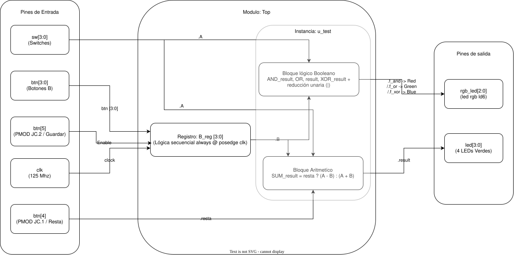
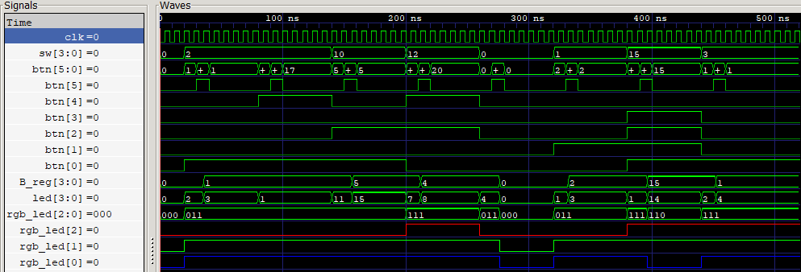
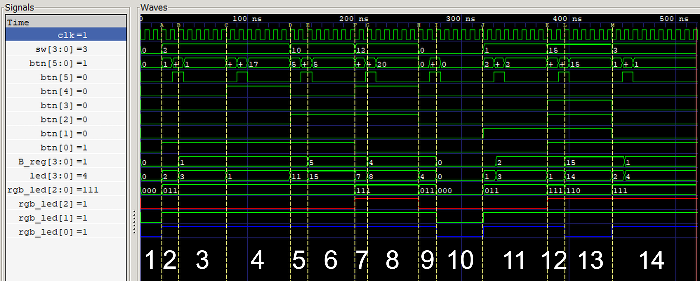
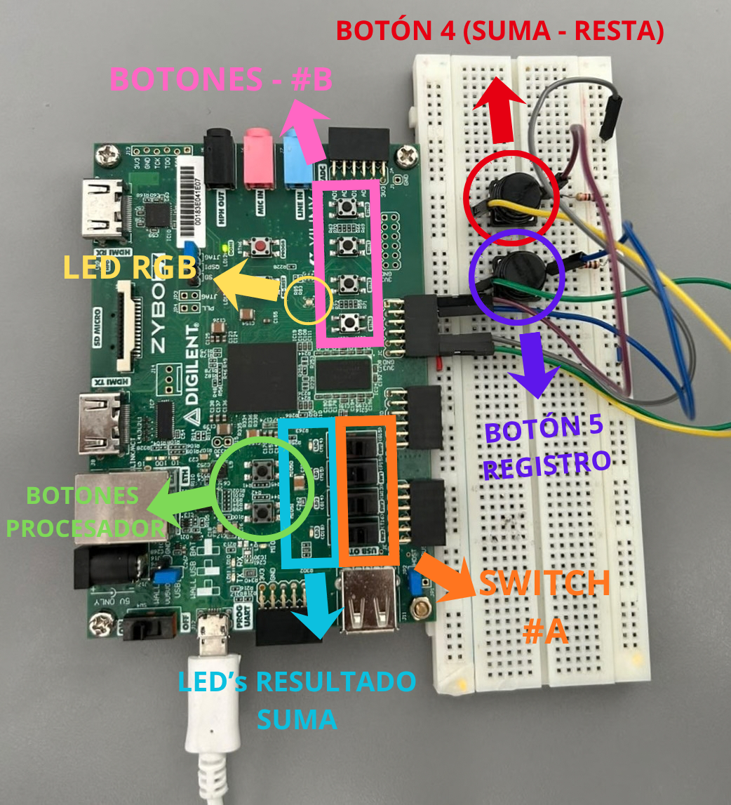
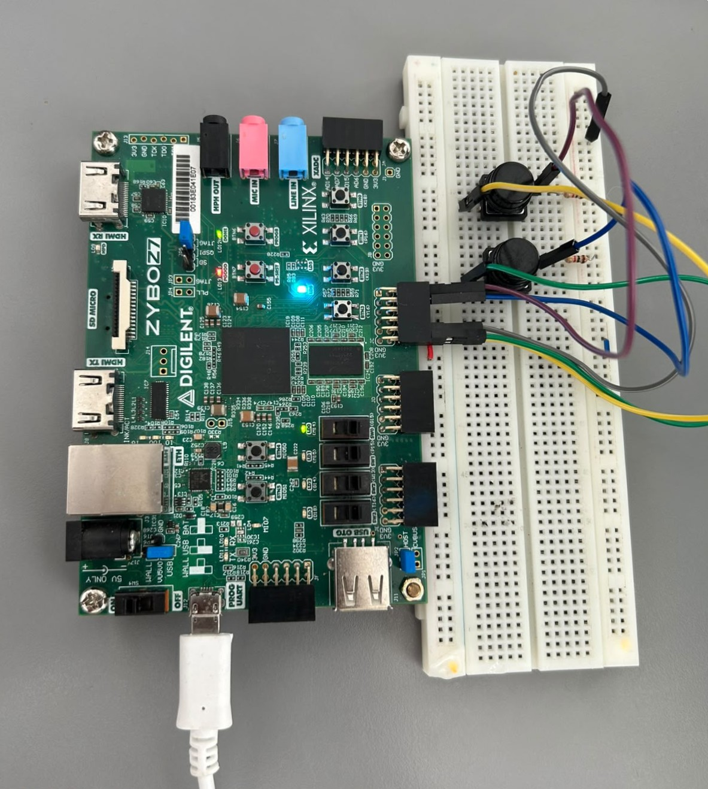
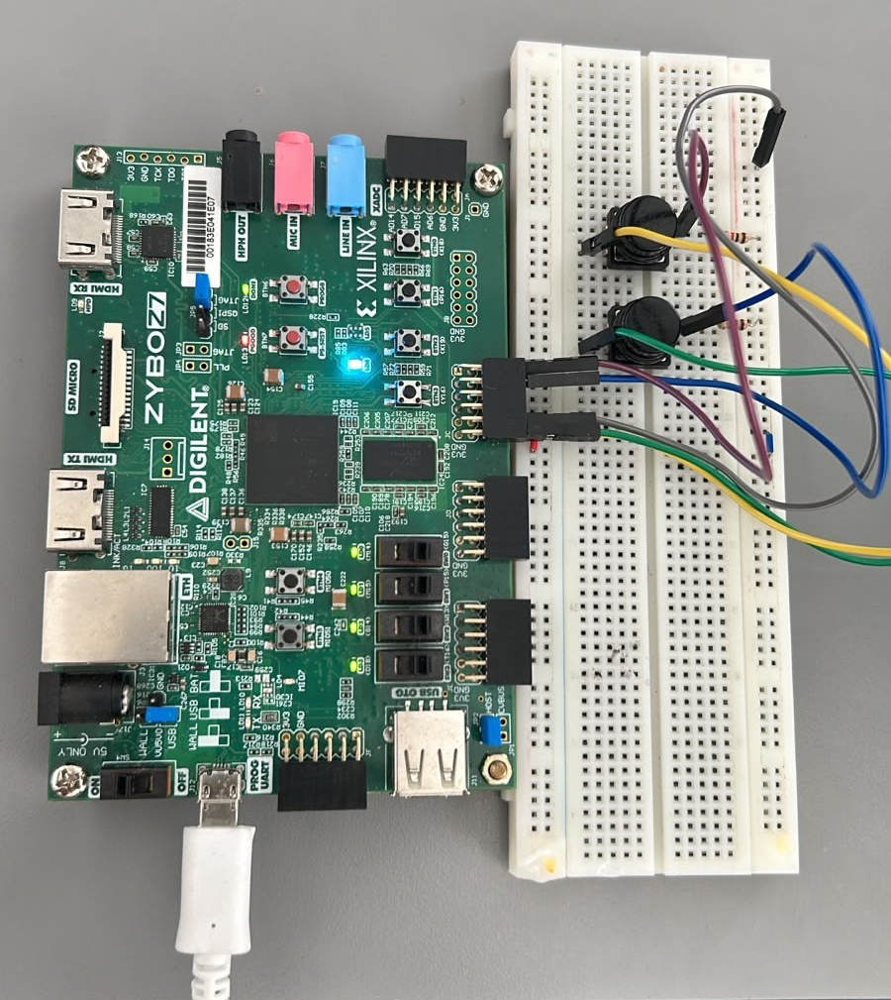
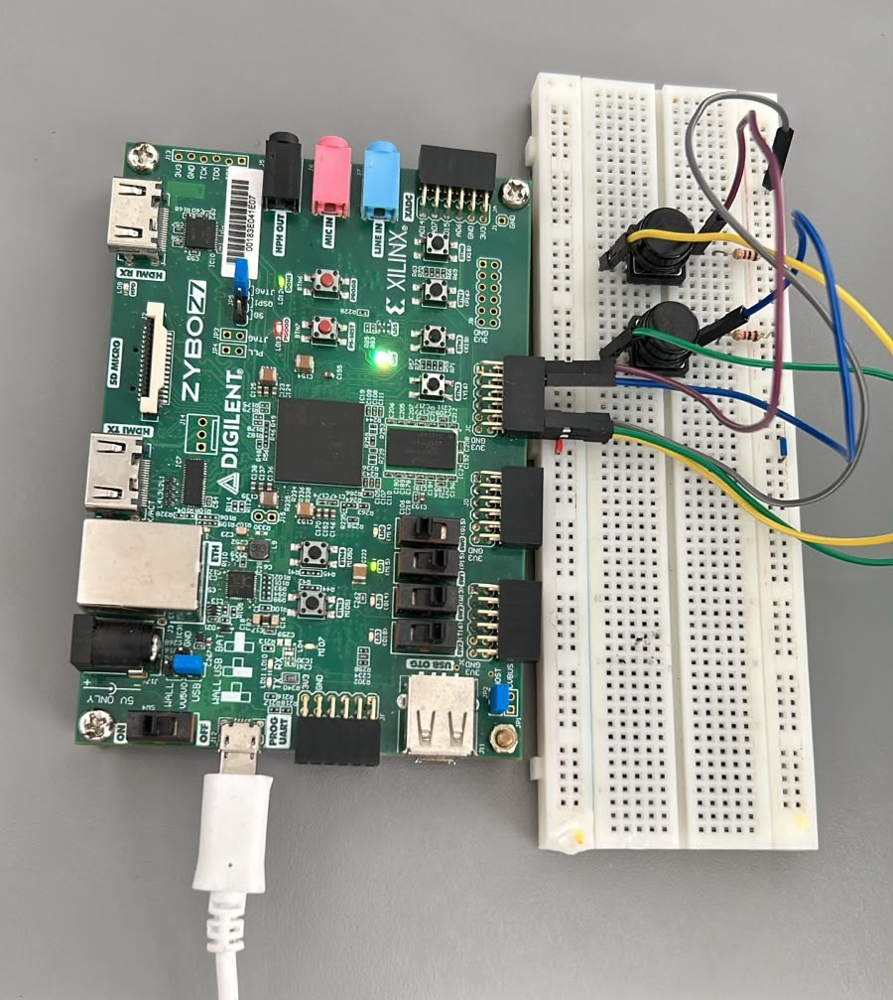
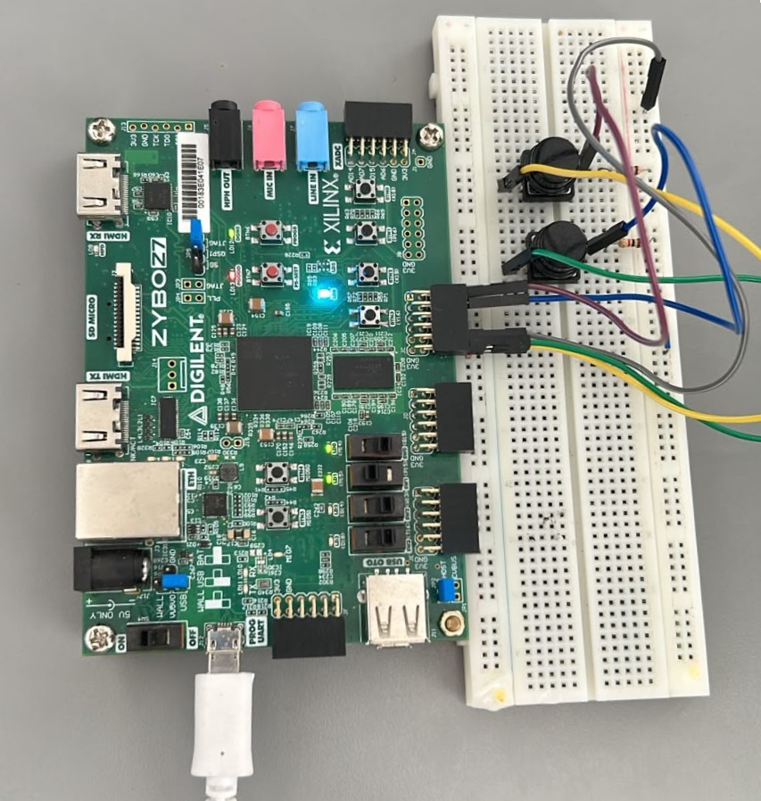
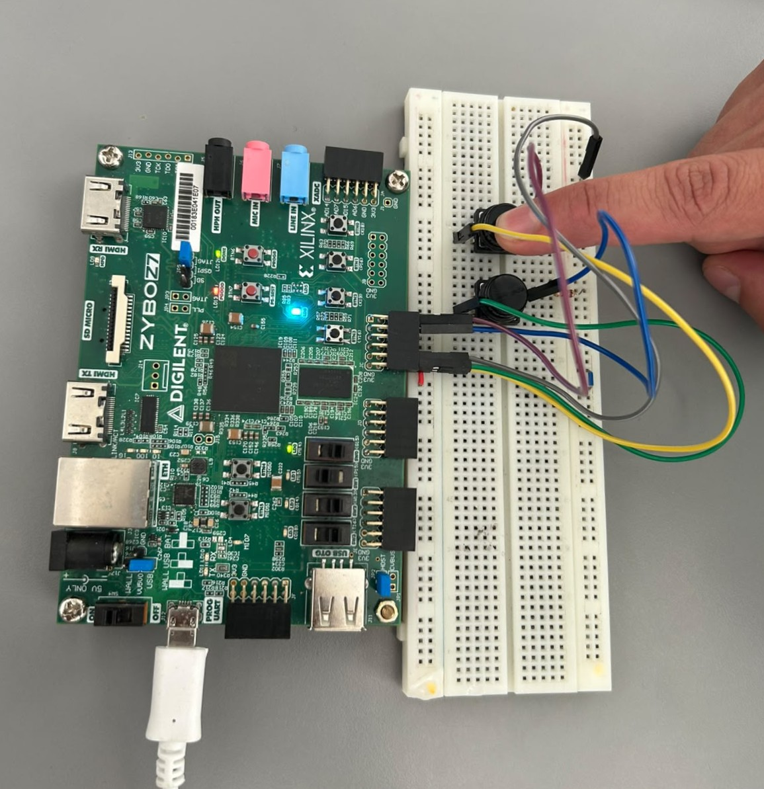

# Laboratorio 01
## FPGA (Zybo Z7), Vivado/Vitis y Validación de Hardware

---

## Integrantes  
- Julian David Gomez Gonzalez - 1007544331
- Cristian Norbey Hernández Gualteros - 1001091723
- Milton Nicolas Rincón Caicedo - 1021312724

**Grupo de trabajo:**  
**Semestre:** 2026-2

---

## Índice
- [Diseño implementado](#diseño-implementado)
- [Simulaciones](#simulaciones)
- [Implementación del Diseño en Verilog](#implementación-del-diseño-en-verilog)
- [Resultados](#resultados)
- [Conclusiones](#conclusiones)
- [Referencias](#referencias)

---

## Diseño implementado

### 1. Tipo de Sistema y Arquitectura General
El diseño corresponde a una arquitectura de Datapath Secuencial con Registro de Carga Habilitada. No requiere una Máquina de Estados Finitos (FSM) multi-estado, ya que el control del flujo se realiza mediante una celda de memoria síncrona (registro de captura con señal de *Enable*) y rutas de datos combinacionales concurrentes.


El sistema se divide en dos etapas principales:
1. **Etapa de Adquisición y Almacenamiento (Secuencial):** Sincronizada a un reloj maestro de 125 MHz (`sys_clk_pin`), encargada de capturar y retener el valor del operando $B$ cuando el usuario activa la señal de escritura (`btn[5]`).
2. **Etapa de Procesamiento Lógico-Aritmético (Combinacional):** Procesa en paralelo el operando directo $A$ y el operando almacenado $B$, ejecutando simultáneamente una operación aritmética de 4 bits (suma o resta seleccionable) y tres operaciones booleanas bit a bit (AND, OR, XOR).




### 2. Construcción y Manejo de Operandos

Para garantizar un diseño no trivial y evaluar la totalidad de los 10 periféricos de entrada disponibles en la Zybo Z7, los operandos de 4 bits se forman mediante dos mecanismos complementarios:

* **Operando $A$ (Entrada Directa / Asíncrona):**
  $$A[3:0] = \{ \text{SW}_3, \text{SW}_2, \text{SW}_1, \text{SW}_0 \}$$
  Se mapea directamente a los interruptores deslizantes (`sw[3:0]`). Cualquier cambio físico en los switches se refleja de manera inmediata en la lógica combinacional sin depender del reloj del sistema.

* **Operando B (Entrada Registrada / Síncrona):**
  `B[3:0] = B_reg[3:0]`  
  Los botones físicos de la placa (`btn[3:0]`) permiten seleccionar el dato temporal para $B$. Para evitar que el valor se pierda al soltar los pulsadores, se implementó un registro síncrono de 4 bits (`B_reg`). El dato se almacena en memoria únicamente cuando ocurre un flanco de subida de `clk` y se presiona el botón externo `btn[5]` (PMOD JC, Pin 2), actuando como señal de *Write Enable*:
  
  ```verilog
  always @(posedge clk) begin
      if (btn[5]) begin
          B_reg <= btn[3:0];
      end
  end
   ```
---

### 3. Operaciones Aritméticas y Control (LEDs Verdes)

La unidad aritmética calcula la suma o la resta en complemento a dos truncada a 4 bits según el estado de la línea de control `btn[4]` (PMOD JC, Pin 1):

$$
\mathrm{SUM\_result} = \begin{cases} 
A + B_{\mathrm{reg}}, & \text{si } \mathrm{btn}[4] = 0 \text{ (Modo Suma)} \\ 
A - B_{\mathrm{reg}}, & \text{si } \mathrm{btn}[4] = 1 \text{ (Modo Resta)} 
\end{cases}
$$

El resultado binario de 4 bits se asigna continuamente a los 4 LEDs verdes de la tarjeta (`led[3:0]`):
* `led[0]` (LD0): Bit menos significativo (LSB, posición $2^0$).
* `led[1]` (LD1): Bit posición $2^1$.
* `led[2]` (LD2): Bit posición $2^2$.
* `led[3]` (LD3): Bit más significativo (MSB, posición $2^3$).

---

### 4. Operaciones Lógicas y Visualización en LED RGB

En paralelo a la operación aritmética, el módulo computa tres operaciones booleanas bit a bit entre los operandos de 4 bits:

$$
\begin{aligned}
\mathrm{AND\_result} &= A \land B_{\mathrm{reg}} \\
\mathrm{OR\_result}  &= A \lor B_{\mathrm{reg}} \\
\mathrm{XOR\_result} &= A \oplus B_{\mathrm{reg}}
\end{aligned}
$$

Para condensar cada bus de 4 bits en un indicador de 1 bit para cada canal del LED RGB (`LD6`), se aplican **operadores de reducción unarios (`|`)**, los cuales equivalen a una compuerta OR extendida a lo largo de los 4 bits de cada vector:

$$
\begin{aligned}
\mathrm{rgb\_led}[2] \ (\text{Rojo})  &= |\mathrm{AND\_result} = \mathrm{AND}[3] \lor \mathrm{AND}[2] \lor \mathrm{AND}[1] \lor \mathrm{AND}[0] \\
\mathrm{rgb\_led}[1] \ (\text{Verde}) &= |\mathrm{OR\_result}  = \mathrm{OR}[3] \lor \mathrm{OR}[2] \lor \mathrm{OR}[1] \lor \mathrm{OR}[0] \\
\mathrm{rgb\_led}[0] \ (\text{Azul})  &= |\mathrm{XOR\_result} = \mathrm{XOR}[3] \lor \mathrm{XOR}[2] \lor \mathrm{XOR}[1] \lor \mathrm{XOR}[0]
\end{aligned}
$$

#### Matriz de Comportamiento del LED RGB:
| Condición Lógica | R (AND) | G (OR) | B (XOR) | Color Resultante | Interpretación Física |
| :--- | :---: | :---: | :---: | :---: | :--- |
| $A = 0 \land B = 0$ | 0 | 0 | 0 | **Apagado** | No hay ningún bit activo en el sistema. |
| $A \neq B \land (A \land B = 0)$ | 0 | 1 | 1 | **Cyan** | Existen bits en '1' pero en posiciones distintas (presencia y diferencia, sin coincidencia). |
| $A = B \land (A, B \neq 0)$ | 1 | 1 | 0 | **Amarillo** | Ambos operandos son idénticos y no nulos (coincidencia total, sin diferencia). |
| $A \neq B \land (A \land B \neq 0)$ | 1 | 1 | 1 | **Blanco** | Coinciden en al menos un bit y difieren en otro (se activan todas las compuertas). |

*Restricción matemática:* Debido a la relación booleana fundamental $(A \lor B) = (A \land B) \lor (A \oplus B)$, la activación de la compuerta AND o de la compuerta XOR fuerza de manera obligatoria la activación de la compuerta OR. Por esta razón, el canal Verde siempre acompaña al Rojo o al Azul, haciendo físicamente imposible obtener Rojo o Azul puro de forma aislada.

---

### 5. Resumen de Mapeo de Entradas y Salidas
| Identificador HDL | Periférico Físico | Pin Zybo Z7 | Estándar I/O | Descripción Funcional |
| :--- | :--- | :---: | :---: | :--- |
| `clk` | Oscilador interno | K17 | LVCMOS33 | Reloj maestro del sistema (125 MHz, 8.00 ns). |
| `sw[0]` .. `sw[3]` | Switches SW0 a SW3 | G15, P15, W13, T16 | LVCMOS33 | Bits $A[0]$ a $A[3]$ de lectura directa. |
| `btn[0]` .. `btn[3]` | Botones BTN0 a BTN3 | K18, P16, K19, Y16 | LVCMOS33 | Bits de datos temporales para almacenar en $B$. |
| `btn[4]` | Botón externo (PMOD JC.1) | V15 | LVCMOS33 (Pulldown) | Selector aritmético: 0 = Suma, 1 = Resta. |
| `btn[5]` | Botón externo (PMOD JC.2) | W15 | LVCMOS33 (Pulldown) | Enable de captura síncrona para $B_{\text{reg}}$. |
| `led[0]` .. `led[3]` | LEDs verdes LD0 a LD3 | M14, M15, G14, D18 | LVCMOS33 | Visualización del resultado aritmético (4 bits). |
| `rgb_led[2]` | LED RGB 6 (Rojo) | V16 | LVCMOS33 | Indicador de coincidencia booleana (`|AND`). |
| `rgb_led[1]` | LED RGB 6 (Verde) | F17 | LVCMOS33 | Indicador de presencia booleana (`|OR`). |
| `rgb_led[0]` | LED RGB 6 (Azul) | M17 | LVCMOS33 | Indicador de diferencia booleana (`|XOR`). |

---

## Simulaciones

### Verificación y Simulación del Diseño

#### Descripción del testbench

El testbench fue diseñado para verificar el correcto funcionamiento del módulo principal (`top.v`) que a su vez instancia (`test_funcional.v`), insertando señales controladas que emulan la interacción del usuario con el hardware. Se configuró un reloj de 125 MHz y se programó una tarea repetitiva (`guardar_b`) que simula la pulsación del botón `btn[5]` para almacenar el operando $B$ en el registro. El código evalúa secuencialmente operaciones aritméticas (sumas y restas con operandos pequeños y grandes) y, posteriormente, inyecta casos específicos para validar la lógica del indicador de estado RGB. 

A continuación, se detallan las evidencias de la simulación extraídas de GTKWave junto con su respectivo análisis.

#### Señales observadas

Durante la simulación en GTKWave se monitorearon las siguientes señales:

*   **Entradas:** `clk` (señal de reloj), `sw[3:0]` (operando $A$ de entrada directa) y `btn[5:0]` (incluye el operando $B$ a registrar, el selector de suma/resta y el botón de guardado).
*   **Salidas:** `led[3:0]` (resultado binario de la operación aritmética) y `rgb_led[2:0]` (indicador de estado lógico de las compuertas AND, OR y XOR).

Tal y como se visualiza en la siguiente imagen:



#### Resultados obtenidos

Para la explicación de los resultados obtenidos del `tb_simulacion.v`, en la siguiente imagen se visualiza la simulación en GTKWave dividida en 14 zonas diferentes. Esto facilita la explicación y hace evidente cómo cambian las señales con cada una de las pruebas realizadas, todo ello con la finalidad de probar el correcto funcionamiento de la FPGA Zybo-Z7-10.



A continuación, se detalla el comportamiento del circuito en cada zona temporal de la simulación:

*   **Zona 1:** Estado inicial de reposo. No se ha modificado ninguna señal.
*   **Zona 2:** El operando $A$ toma el valor de 2 y $B$ toma el valor de 1 en los interruptores. Sin embargo, como no se ha presionado el botón de guardado (`btn[5]`), el registro interno de $B$ sigue siendo 0. Por lo tanto, la suma (`led[3:0]`) es igual a 2 ($2 + 0$).
*   **Zona 3:** Se presiona el `btn[5]`, actualizando el registro de $B$ con el valor 1. Se efectúa la suma, dando como resultado 3 en `led[3:0]` ($2 + 1 = 3$).
*   **Zona 4:** Se activa el `btn[4]` (modo resta). El resultado en `led[3:0]` cambia a 1 ($2 - 1 = 1$).
*   **Zona 5:** El operando $A$ toma el valor de 10 y $B$ el valor de 5 en los interruptores. Al no haberse presionado `btn[5]`, el registro conserva el 1 anterior y el modo de operación vuelve a suma. El resultado en `led[3:0]` toma el valor de 11 ($10 + 1 = 11$).
*   **Zona 6:** Se presiona el `btn[5]` y se guarda el 5 en el registro de $B$. Se efectúa la suma dando como resultado 15 en `led[3:0]` ($10 + 5 = 15$). Esta operación verifica que los 4 LEDs verdes de la suma funcionan correctamente al encenderse todos a la vez.
*   **Zona 7:** El operando $A$ toma el valor de 12 y $B$ permanece con el valor de 5. Se activa el `btn[4]` (resta), por lo que la salida `led[3:0]` toma el valor de 7 ($12 - 5 = 7$).
*   **Zona 8:** El operando $B$ cambia de valor a 4 en los interruptores y se guarda en el registro. Como permanece activo el `btn[4]` (resta), el resultado en `led[3:0]` toma el valor de 8 ($12 - 4 = 8$).
*   **Zona 9:** El operando $A$ cambia de valor a 0 preparándose para la validación de la lógica RGB.
*   **Zona 10:** Los operandos $A$ y $B$ son cero. Al no haber bits activos, las compuertas lógicas arrojan cero y el LED RGB está totalmente apagado (Estado 000).
*   **Zona 11:** El operando $A$ cambia a 1 y $B$ se actualiza a 2. Al tener bits activos en posiciones distintas (0001 y 0010), se detecta presencia (OR) y diferencia (XOR), pero no coincidencia (AND). Esto enciende el LED Verde y el Azul (Cyan: 011).
*   **Zona 12:** El operando $A$ cambia a 15 (1111) en los interruptores. Se observa una transición en la lógica antes de guardar el nuevo operando $B$.
*   **Zona 13:** El operando $B$ se actualiza a 15 (1111). Al ser idénticos ambos operandos ($A=15$, $B=15$), hay coincidencia y presencia en los bits, pero la diferencia es nula (XOR = 0). Como resultado, se encienden los LEDs Rojo y Verde (Amarillo: 110).
*   **Zona 14:** El operando $A$ cambia a 3 (0011) y $B$ se actualiza a 1 (0001). Ambos números comparten el primer bit, pero difieren en el segundo. Se cumplen simultáneamente todas las condiciones lógicas, activando los tres canales para formar el color Blanco (RGB Completo: 111).

---

En resumen, las formas de onda resultantes confirmaron el funcionamiento esperado del circuito, dividiéndose en dos etapas de validación clave:

#### A. Validación Aritmética (Señal `led`):
Se verificaron cuatro casos de prueba controlados:
*   **Suma (2 + 1):** Al ingresar $A=2$ y $B=1$ con `btn[4]=0`, la salida mostró 0011 (3 en decimal).
*   **Resta (2 - 1):** Con los mismos operandos y activando `btn[4]=1`, la salida cambió correctamente a 0001 (1).
*   **Suma mayor (10 + 5):** Se probó la capacidad de los 4 bits; la salida mostró 1111 (15).
*   **Resta mayor (12 - 4):** El sistema calculó la diferencia arrojando 1000 (8).

#### B. Validación del Indicador Lógico (Señal `rgb_led`):
Se buscó representar el encendido de los colores considerando la restricción matemática del diseño: no es posible encender los canales Rojo o Azul de forma aislada, ya que la existencia de bits compartidos (AND) o diferentes (XOR) fuerza siempre la activación de la compuerta OR (Verde). Por ello, se verificaron los 4 únicos estados posibles:
*   **Apagado (000):** Operandos en cero ($A=0$, $B=0$).
*   **Cyan / Verde+Azul (011):** Bits activos en posiciones distintas ($A=1$, $B=2$). Se detecta presencia y diferencia, pero no coincidencia.
*   **Amarillo / Rojo+Verde (110):** Operandos idénticos ($A=15$, $B=15$). Hay coincidencia y presencia, pero la diferencia es nula (XOR = 0).
*   **Blanco / RGB Completo (111):** Comparten un bit, pero difieren en otro ($A=3$, $B=1$). Todas las condiciones lógicas se cumplen simultáneamente.
---

## Implementación del Diseño en Verilog


### Organización del Código
El diseño se estructuró en dos módulos jerárquicos, separando la lógica secuencial (memoria) de la lógica combinacional:

```
top.v  (módulo top / wrapper)
 └── test_funcional.v  (lógica combinacional, instancia u_test)
```

* **`top.v`:** es el módulo top del proyecto y el único conectado a los pines físicos de la tarjeta mediante el archivo `Zybo-Z7.xdc`. Se encarga de:
  1.  Asignación directa de los interruptores físicos (`sw[3:0]`) al operando $A$.
  2.  Implementación de un registro de 4 bits (`B_reg`) para almacenar el operando $B$ proveniente de los botones BTN0 a BTN3 de la tarjeta (`btn[3:0]`).
  3.  Conecta $A$, `B_reg` y el selector `btn[4]` a las entradas de `test_funcional`, y sus salidas directamente a los LEDs verdes y al LED RGB.
     
* **`test_funcional.v`:** sus salidas dependen únicamente de los valores actuales de sus entradas. Se encarga de:
  
  1.  Ejecución simultánea de las operaciones aritméticas (sumador/restador controlado por multiplexor) y compuertas lógicas bit a bit (AND, OR, XOR).
  2.  Resultado aritmético de 4 bits (`result`) y tres indicadores de 1 bit (`f_and`, `f_or`, `f_xor`) obtenidos mediante operadores de reducción.

Esta separación entre la lógica combinacional (`test_funcional.v`) y los elementos de almacenamiento y conexión física (`top.v`) sirve como base para la ALU del siguiente laboratorio, en la cual se planea mantener  la ALU como módulo combinacional independiente y los registros de operandos fuera de ella, en el módulo superior.


### Reloj y Reset

*   **Señal de Reloj (Clock):** El sistema utiliza el oscilador interno de la tarjeta Zybo Z7, el cual ingresa por el pin K17 a una frecuencia de 125 MHz. Esta señal de reloj (`clk`) se utiliza exclusivamente para sincronizar el bloque secuencial del registro $B$. La captura de datos se realiza por flanco de subida (`posedge clk`) condicionado a la habilitación (enable) del botón `btn[5]`.
*   **Reset:** Se implementó un **Power-on Reset (POR)** mediante la inicialización directa en la declaración del registro (`reg [3:0] B_reg = 4'b0000;`). Esto nos permite que, al cargar el *bitstream* en la FPGA, la memoria arranque en un estado seguro y conocido (cero).

### Comportamiento Esperado del Sistema

Al operar físicamente la FPGA, el sistema responde de la siguiente manera:
1.  **Ingreso en Tiempo Real:** Cualquier cambio en los interruptores (`sw[3:0]`) modifica instantáneamente el operando $A$, actualizando en tiempo real tanto la suma/resta en los LEDs verdes como el estado lógico en el LED RGB.
2.  **Almacenamiento:** El usuario ingresa un valor en `btn[3:0]`. Este valor no afecta al sistema hasta que se presiona `btn[5]`. Al presionarlo, en el siguiente flanco del reloj (cuestión de nanosegundos), el valor queda guardado en el registro `B_reg `del módulo top y pasa a ser el operando $B$ oficial.
3.  **Selector de Operación:** El interruptor o botón asignado a `btn[4]` actúa como un selector de modo en tiempo real; en estado bajo (`0`) el sistema suma $A + B$, y en estado alto (`1`) el sistema resta $A - B$. Las operaciones lógicas en el LED RGB no se ven interrumpidas por este cambio, ya que se procesan en rutas de datos paralelas.
---

## Resultados

### Smoke Test:

Para la evidencia del Smoke test, se muestra un video con el funcionamiento del semáforo con el archivo que fue proporcionado por el docente, esto sirvió para comprobar el funcionamiento de la FPGA y fue base para la explicación de como programar la misma con el aplicativo de *Vivado*.

#### Evidencia Smoke test:

  
### Limitaciones Arquitectónicas de la Placa Zybo Z7: Problemas con los Botones 4 y 5 (Botones MIO50 y MIO51)

Al implementar el diseño físico en la tarjeta Zybo Z7, surgió una restricción importante relacionada con el uso de botones adicionales (específicamente aquellos referenciados como Botón 4 y Botón 5). Esta limitación no fue un  error de código, sino una característica estricta de la arquitectura del chip Zynq-7000.

#### Arquitectura SoC Zynq-7000 (PL vs. PS)
El "cerebro" de la tarjeta Zybo Z7 es un *System-on-Chip* (SoC) que integra dos subsistemas completamente distintos dentro del mismo empaquetado:
1.  **PL (Programmable Logic):** Es la FPGA tradicional. Es el área donde se implementan los circuitos diseñados en Verilog (hardware puro).
2.  **PS (Processing System):** Es un procesador ARM Cortex-A9 interno (software).

#### El Problema de Enrutamiento con los Pines MIO
En la placa Zybo Z7, los botones estándar (`BTN0`, `BTN1`, `BTN2` y `BTN3`) están soldados y enrutados físicamente a los pines de la FPGA (zona **PL**). Esto permite asignarlos directamente en el archivo de restricciones (`.xdc`) y leerlos en tiempo real con código Verilog.

Sin embargo, los botones o interfaces referenciados en los esquemáticos como conectados a **MIO50** y **MIO51** pertenecen a la red de *Multiplexed I/O* (Entradas/Salidas Multiplexadas). Estos pines le pertenecen exclusivamente al procesador ARM (zona PS). La FPGA (zona PL) no tiene una conexión física de hardware directo hacia ellos. Por este motivo, estos botones no funcionaban y se tuvo que optar por utilizar botones externos que los reemplazaran.

#### Implicaciones para el Diseño en Verilog
Al intentar asignar una variable de Verilog (como `btn[4]` o `btn[5]`) a los pines físicos MIO50 o MIO51 en el archivo `.xdc`, la herramienta de síntesis (Vivado) arrojaba un error de mapeo, ya que el diseño RTL es "ciego" a los pines del procesador. 

Es así como después de ese error, se modificó una parte del archivo de restricciones (`.xdc`).

**Visualización botones, switches y leds en la FPGA:**

Para corroborar los resultados de la simulación, se implementó el diseño en la FPGA. En la siguiente imagen se detalla la asignación de los componentes físicos (botones, interruptores y LEDs) utilizados durante la prueba:

*   **Recuadro Naranja:** Interruptores (`sw[3:0]`) que asignan el valor directo al operando $A$.
*   **Recuadro Rosado:** Botones (`btn[3:0]`) que permiten ingresar el valor del operando $B$.
*   **Círculo Rojo (Botón):** Representa el `btn[4]`. Funciona como selector de operación; si no se presiona (`btn[4]=0`) el sistema suma, y si se mantiene presionado (`btn[4]=1`) el sistema resta.
*   **Círculo Morado (Botón):** Es el `btn[5]`. Cada vez que se presiona, registra y guarda en la memoria el número que se esté ingresando en ese momento en los botones $B$.
*   **Recuadro Celeste (LEDs):** Son los 4 LEDs de color verde (`led[3:0]`) que dejan ver el resultado aritmético de la suma o la resta en formato binario.
*   **Círculo Amarillo (LED RGB):** Es el `RGB_Led[2:0]`, funciona como indicador de estado lógico.
*   **Círculo Verde:** Botones del procesador ARM (zona PS).




A continuación, se describen los eventos ocurridos durante los distintos casos de prueba en hardware:

#### 1. Registro Pequeño y Generación de Cyan
En este primer evento, se probó el guardado de un valor pequeño. Se ingresó el valor de 1 en los botones y se registró presionando `btn[5]`, asignando $B=1$ (`0001`), mientras los interruptores se mantuvieron en $A=0$ (`0000`). Como resultado aritmético, el LED verde menos significativo se encendió mostrando la suma ($0+1=1$). 

Adicionalmente, el indicador RGB mostró un tono predominantemente azulado claro. Este es un evento matemáticamente correcto que corresponde al color **Cyan** (Verde + Azul), cuyo desglose lógico es el siguiente:
*   **Canal Rojo (AND):** Requiere que $A$ y $B$ tengan un '1' en la misma posición. Como $A$ es todo ceros, no hay coincidencia posible (`0000 & 0001 = 0000`). **Rojo apagado.**
*   **Canal Verde (OR):** Requiere al menos un '1' en el sistema. El operando $B$ aporta este uno lógico (`0000 | 0001 = 0001`). **Verde encendido.**
*   **Canal Azul (XOR):** Requiere una diferencia entre los bits de $A$ y $B$. En la primera posición, difieren (`0` y `1`), activando la compuerta (`0000 ^ 0001 = 0001`). **Azul encendido.**



#### 2. Registro Grande
Por otro lado, en esta imagen se visualizan los 4 LEDs verdes encendidos después de guardar. Es decir, después de presionar el `btn[5]` para asignar el valor de $B=15$ (`1111`) y manteniendo $A=0$. Por lo tanto, el resultado de la suma es igual a 15, lo que enciende todos los LEDs de resultado. 

En este caso, el LED RGB vuelve a mostrar color **Cyan**. La razón es idéntica al caso anterior: al ser $A=0$, es imposible que compartan bits (AND = 0, Rojo apagado), pero la presencia de los '1's lógicos de $B$ activa la compuerta OR (Verde) y sus diferencias frente a los ceros de $A$ activan la compuerta XOR (Azul).



#### 3. Operandos Iguales ($A=1, B=1$)
En este evento, se asignó el valor de 1 tanto al operando $A$ (vía interruptor) como al operando $B$ (vía registro). El resultado aritmético encendió el segundo LED verde, indicando una suma igual a 2 (`0010`). En cuanto al LED RGB, este mostró una mezcla de **Rojo y Verde** (Amarillo). Esto ocurre porque ambos operandos comparten exactamente el mismo bit (AND = 1, Rojo encendido) y aportan presencia lógica (OR = 1, Verde encendido), pero al ser idénticos no existen diferencias entre ellos (XOR = 0, Azul apagado).



#### 4. Operación de Suma ($A=2, B=1$)
Para esta prueba, se cambió el operando de los interruptores a $A=2$ (`0010`) manteniendo $B=1$ (`0001`). Los dos LEDs verdes menos significativos se encendieron, indicando el resultado esperado de 3 (`0011`). El LED RGB volvió a mostrar **Cyan**, ya que los operandos tienen bits activos pero en diferentes posiciones, lo que activa el Verde (OR) y el Azul (XOR), pero deja el Rojo (AND) apagado al no haber coincidencias.



#### 5. Operación de Resta ($A=2, B=1$)
Finalmente, conservando exactamente los mismos valores anteriores ($A=2, B=1$), se mantuvo presionado el botón rojo `btn[4]` para cambiar el modo de operación a resta. El resultado aritmético cambió instantáneamente para mostrar la resta matemática ($2 - 1 = 1$), encendiendo únicamente el primer LED verde. Cabe destacar que el indicador RGB se mantuvo en **Cyan**, demostrando físicamente que las compuertas lógicas operan en paralelo y evalúan los operandos de entrada independientemente de si la operación seleccionada es suma o resta.



---

## Conclusiones

- A través de esta práctica se logró comprender el flujo de trabajo en *Vivado* para diseñar e implementar circuitos en la FPGA *Zybo Z7*. El circuito desarrollado permitió comprobar el funcionamiento de los interruptores, botones y LEDs de la tarjeta. Este código será útil en futuros laboratorios para verificar que los componentes funcionen correctamente antes de realizar diseños más complejos.

- Se identificó una limitación de la arquitectura Zynq-7000: no todos los botones de la tarjeta se pueden utilizar directamente en diseños de hardware en Verilog. Para esta práctica, se utilizaron los 4 interruptores (`SW0-SW3`) y los botones `BTN0-BTN3`, que están conectados a la Lógica Programable (PL). Para agregar más entradas, se pueden utilizar los puertos de expansión PMOD o cambiar las funciones de los interruptores disponibles. Esto debido a que los botones `BTN4 y BTN5` están asociados exclusivamente al procesador.

- La simulación con *GTKWave* fue de gran ayuda para comprobar el comportamiento de las señales antes de implementar el diseño en la FPGA. Esto permitió detectar posibles errores y verificar que las operaciones funcionaran como se esperaba, facilitando las pruebas posteriores en la tarjeta física. Reduciendo los tiempos para hacer pruebas repetitivas y redundantes.

- Durante la práctica se comprendió que, a diferencia de un programa convencional, en Verilog varias operaciones pueden ejecutarse al mismo tiempo. Se comprobó que las operaciones de suma y resta y la lógica que controla los LEDs RGB funcionan de manera simultánea, sin que una interfiera con la otra.

- La implementación del indicador RGB permitió comprender mejor la diferencia entre las operaciones aritméticas y las operaciones lógicas. Mediante compuertas como AND, OR y XOR, se pudo utilizar la información de varios bits para controlar un solo color del LED. Esto permitió aprender cómo representar condiciones lógicas mediante indicadores visuales en un circuito digital.
---

## Referencias

1. [**Zybo Z7 Board Reference Manual** - Digilent](https://digilent.com/reference/programmable-logic/zybo-z7/reference-manual)  
   *Manual técnico oficial de la placa Zybo Z7, especificaciones de hardware y periféricos.*

2. [**Zynq-7000 SoC Technical Reference Manual (TRM)** - AMD / Xilinx](https://docs.amd.com/r/en-US/ug585-zynq-7000-SoC-TRM/Introduction?tocId=oRoKUQufl_PGU6ByBXr1ag)  
   *Documentación técnica del chip Zynq-7000, arquitectura y detalles internos.*

3. [**Archivo de Restricciones Maestro (Master XDC) para Zybo-Z7-10** - Repositorio Oficial de Digilent en GitHub](https://github.com/Digilent/Zybo-Z7-10-XADC/blob/master/src/constraints/Zybo-Z7.xdc)  
   *Archivo de configuración (XDC) que mapea las variables físicas a los puertos lógicos de la FPGA.*

